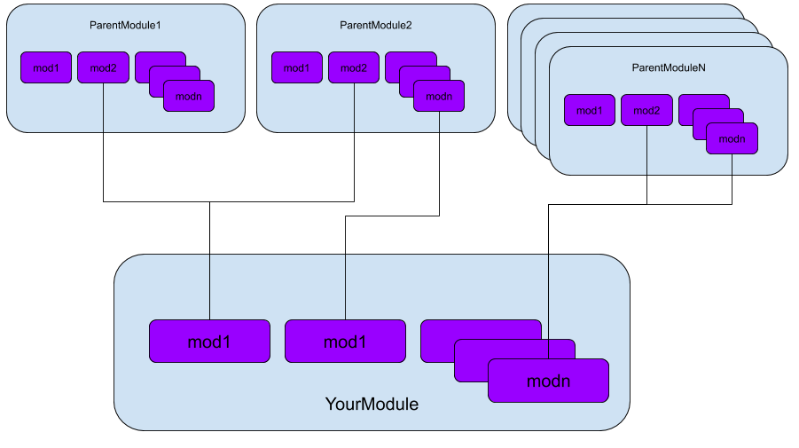

What is VIvP
===============

VIvP is a simple package manager for all your Verilog projects

******************************************************
What does VIvP do?
******************************************************
Much like npm for Node or pip for Python, VIvP is a package manager for Verilog.
The idea is to have all the modules that one might want to use and design to be split up across different repos so that testing and validation of each one becomes convinient.

******************************************************
How does VIvP help in hardware design? 
******************************************************

Let's say you wanted to build a Ripple Carry Adder for this ALU you are designing

Conventionally, you'd have to design the half adders, full adders and other necessary components before you can start building your RCA. This would involve designing and testing every small component

.. image:: img/VIvP_Dep_Ver.png
   :width: 300
   :alt: Dependencies Version

.. image:: img/example1.png
   :width: 300
   :alt: Code

But with VIvP, you can simply install the BasicModules depenency with

``$ vivp -i https://github.com/AdityaNG/BasicModules``

Now you can directly include the "BasicModules/half_adder.v" and "BasicModules/full_adder.v" directly into your RCA module.
An example of the above can be seen in https://github.com/AdityaNG/RippleCarryAdder. The RCA implemented in the above project depends on adders from https://github.com/AdityaNG/BasicModules

******************************************************
Version control and Test Verification in depenencies
******************************************************

All dependencies can be have their own test benches that can be verified to show that said depencency is functioning correctly

Dependencies can also be selected by version. So lets say your favourite depencency got updated and that removed certain functionality, you can easily downgrade and select a version of that depencency that works for you

So you could have the BasicModules being managed by AdityaNG and Bob could depend on this repository for the full_adder and half_adder modules. He can also specifically ask for a version of the BasicModules repo that he knows works for his ALU

Now you can directly include the "BasicModules/half_adder.v" and "BasicModules/full_adder.v" directly into your RCA module
