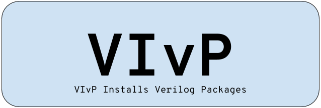

VIvP
================================

| VIvP is a simple package manager for all your Verilog projects. TEST

.. image:: https://img.shields.io/pypi/v/vivp.svg
  :alt: Pypi version

.. image:: https://img.shields.io/pypi/dm/vivp.svg
  :alt: Pypi Downloads

.. image:: https://readthedocs.org/projects/vivp/badge/?version=latest
  :alt: Readthedocs Documentation

.. image:: https://coveralls.io/repos/github/AdityaNG/VIVP/badge.svg
  :alt: Coverage

Installation
===============
You can install from pip

``$ pip install vivp``

Or install directly from the Git repo

``$ pip install git+https://github.com/AdityaNG/VIVP.git``

Documentation
===============
.. toctree::
  :maxdepth: 3

  documentation
  description 
  examples

Indices and tables
==================

* :ref:`genindex`
* :ref:`modindex`
* :ref:`search`
